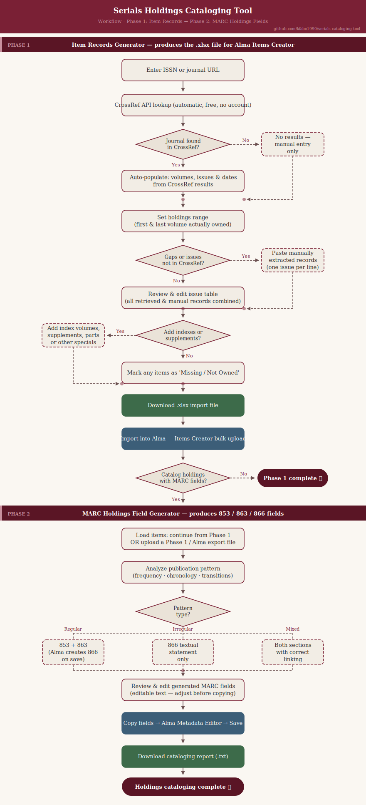

# Serials Holdings Cataloging Tool

A free, browser-based web application that helps library catalogers automate the most repetitive parts of serial holdings cataloging for Ex Libris Alma.

**Live app:** [serials-catalog-app.streamlit.app](https://serials-catalog-app.streamlit.app/)

*This is an independent personal project, not an official product of any institution.*

---

## Workflow



---

## What it does

The tool takes a journal ISSN, retrieves all known volumes and issues from the CrossRef API, guides the cataloger through building a correctly formatted Excel import file for Alma's **Items Creator** bulk import tool, and then analyzes the item records to generate the appropriate MARC 21 Holdings fields — all without inventing or guessing any data.

---

## Phase 1 — Item Records Generator

Produces a ready-to-import `.xlsx` file for Alma's Items Creator tool.

1. **Enter an ISSN or journal URL** — the ISSN is extracted automatically from any URL
2. **CrossRef lookup** — retrieves all registered volumes, issues, and dates automatically
3. **Holdings range** — select the first and last volume owned; records outside that range are excluded
4. **Fill gaps** — paste manually extracted records for issues not in CrossRef (older print-only volumes, etc.); accepts months, combined months (Jan/Feb), and seasons (Spring, Fall/Winter)
5. **Add special items** — add index volumes, supplements, parts, or other non-standard items separately
6. **Review and edit** — full editable table; mark individual issues as "Missing / not owned" to exclude them from the export
7. **Download** — generates a ready-to-import `.xlsx` file with all columns pre-filled: barcodes, enumeration, chronology, descriptions, mms_id, holding_id

---

## Phase 2 — MARC Holdings Field Generator

Analyzes an items list (either from Phase 1 or uploaded directly from an Alma export) to detect the publication pattern and generate correct MARC 21 Holdings fields.

1. **Load items** — continue directly from Phase 1, or upload a Phase 1 export or an Alma physical items export
2. **Pattern analysis** — detects publication frequency (quarterly, monthly, etc.), chronology type (seasonal or monthly), transition points where the pattern changes, and whether the pattern is regular enough for structured MARC fields
3. **MARC field generation**:
   - Regular patterns → `853` (Caption and Pattern) + `863` (Enumeration and Chronology); Alma auto-generates the `866` textual statement when the holdings record is saved
   - Irregular patterns → `866` (Textual Holdings) only
   - Mixed holdings → one section of each, linked correctly
4. **Review and copy** — editable MARC fields displayed ready to paste into the Alma Metadata Editor
5. **Download report** — a cataloging report documenting the detected pattern and all generated fields

---

## Key design principles

- **Never fabricates data** — missing months, unknown issues, and coverage gaps are flagged, never filled in with guesses
- **Human in the loop** — every output is a proposal; the cataloger reviews and approves before anything is imported or applied
- **Free tools only** — no paid APIs, no subscriptions required
- **Standards-compliant** — follows MARC 21 Holdings (MFHD), ANSI/NISO Z39.71, CONSER serials cataloging practice, and Alma's item import format

---

## Security

This tool is designed with a minimal attack surface. It does not connect to Alma or any library system directly, stores no data after a session ends, handles no personal or student information, and requires no user accounts or credentials. All generated outputs are reviewed by the cataloger before use. Specific protections include sanitization of all Excel output against formula injection (a common spreadsheet vulnerability), and validation of uploaded files for both size and internal structure before they are parsed. For any institutional or multi-user deployment, standard additions would apply — authentication, VPN-gated hosting, and audit logging — but for individual cataloger use the current setup is appropriate.

---

## Running locally

**Requirements:** Python 3.9+

```bash
# Clone the repo
git clone https://github.com/kfabo1990/serials-cataloging-tool.git
cd serials-cataloging-tool

# Create a virtual environment and install dependencies
python -m venv .venv
.venv\Scripts\activate        # Windows
# source .venv/bin/activate   # Mac/Linux

pip install -r requirements.txt

# Run the app
streamlit run app.py
```

The app opens automatically in your browser at `http://localhost:8501`.

---

## Tech stack

| Tool | Purpose |
|---|---|
| Python 3.x | Core language |
| Streamlit | Web UI (runs in the browser) |
| requests | CrossRef API calls |
| pandas | Data handling |
| openpyxl | Excel file generation and reading |

All free and open source. No paid APIs or external AI services are called by the app.

---

## Data sources

- **CrossRef REST API** (`api.crossref.org`) — free, no account required
- **Alma physical items export** (Phase 2) — Excel file exported by the cataloger from their own Alma instance
- Manual entry by the cataloger for records not available in CrossRef

---

## Standards

| Standard | Role |
|---|---|
| MARC 21 Holdings Format (MFHD) | Structure of 853 / 863 / 866 fields (Phase 2) |
| ANSI/NISO Z39.71 | Holdings statements for serial publications |
| CONSER Cataloging Manual | Serials-specific cataloging practices and decisions |
| Ex Libris Alma item import format | Column names and rules for the Excel bulk upload |

---

## Possible future directions

This is a working tool but there is room to grow. Some directions that would make sense next:

- **Smarter gap detection** — comparing what CrossRef reports against what is actually in the items list to flag missing issues automatically
- **Batch processing** — run multiple ISSNs through Phase 1 in one session, useful during a larger retrospective cataloging project
- **MARC validation** — check generated 853/863 fields against the full MARC 21 Holdings specification before displaying them
- **Direct Alma API integration** — instead of an Excel import, push item records and holdings fields directly to Alma via the REST API (would require institutional authentication)
- **Holdings comparison** — load two Alma exports (e.g. before and after a withdrawal project) and show what changed

---

## License

MIT — see [LICENSE](LICENSE)
